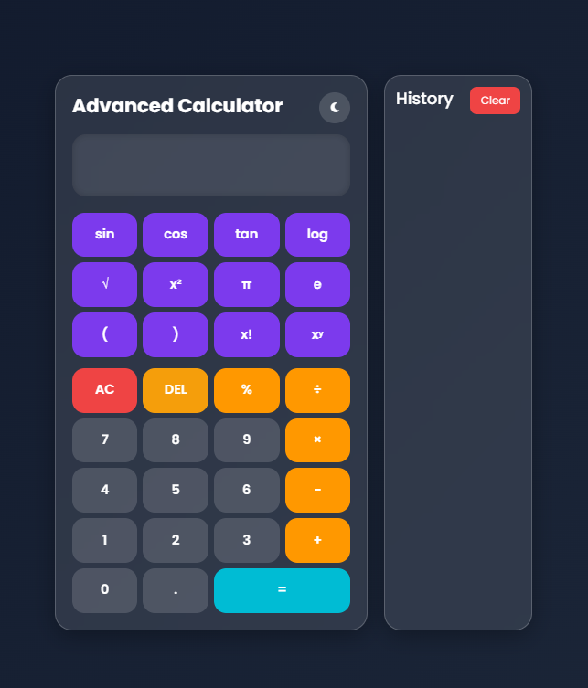
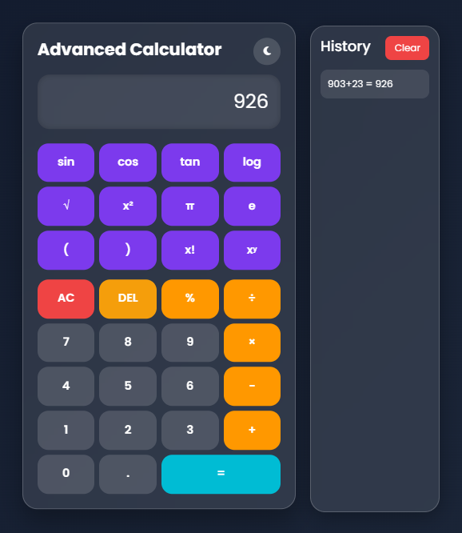
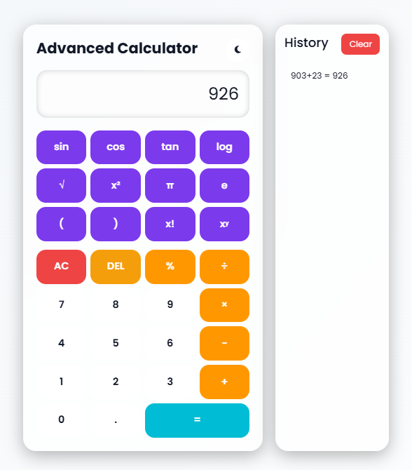

## 🚀 Advanced Scientific Calculator

A modern and fully responsive Advanced Scientific Calculator Web Application developed using HTML5, CSS3, Bootstrap 5, and Vanilla JavaScript.

This project features a premium Glassmorphism UI, Dark/Light Mode, Scientific Functions, Calculation History, and smooth animations for a professional user experience.

## ✨ Features

* Basic & Scientific Calculations
* Dark/Light Theme Toggle
* Glassmorphism UI Design
* Responsive Layout
* Keyboard Support
* Calculation History
* Smooth Animations
* Error Handling

## 🧠 Scientific Functions

* sin(), cos(), tan()
* log(), ln()
* sqrt(), square(), power()
* factorial()
* π and e values
* Percentage & brackets support

## 🛠️ Technologies Used

* HTML5
* CSS3
* Bootstrap 5
* JavaScript
* LocalStorage

## 📱 Responsive Design

Optimized for:

* Mobile
* Tablet
* Desktop

## 📂 Project Structure

calculator-project/
│

├── index.html

├── styles.css

└── script.js

## 🎯 Learning Outcome

This project improved my skills in:

* JavaScript Logic
* DOM Manipulation
* Responsive Web Design
* UI/UX Design
* LocalStorage Handling

## 🌐 Live Demo

🔗 https://eshasagars310.github.io/Calculator/

## 📸 Screenshots

**🔍 NOTE:** Best viewed at 60–80% browser zoom for an optimized desktop experience.

## 👨‍💻 Developer

Developed by **Esha Sagar S**

⭐ Star this repository if you like the project.
